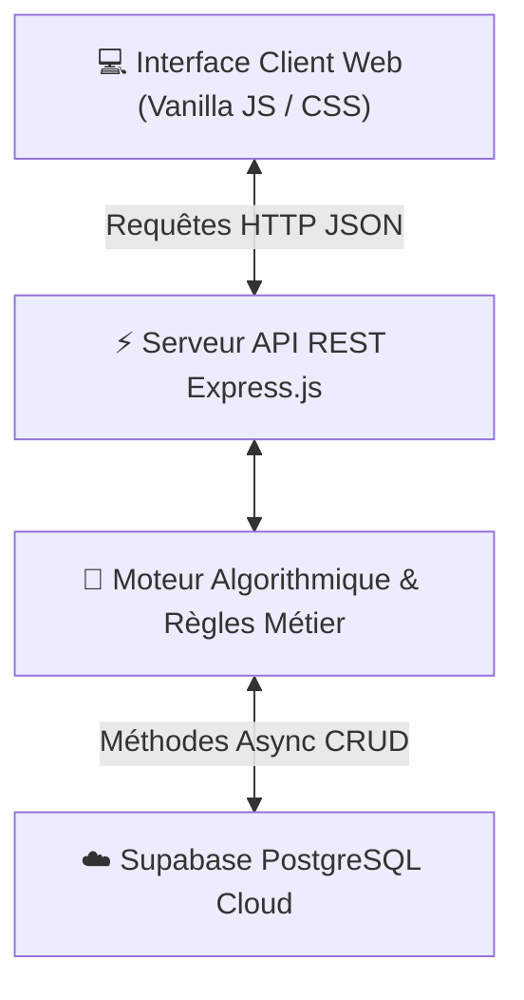
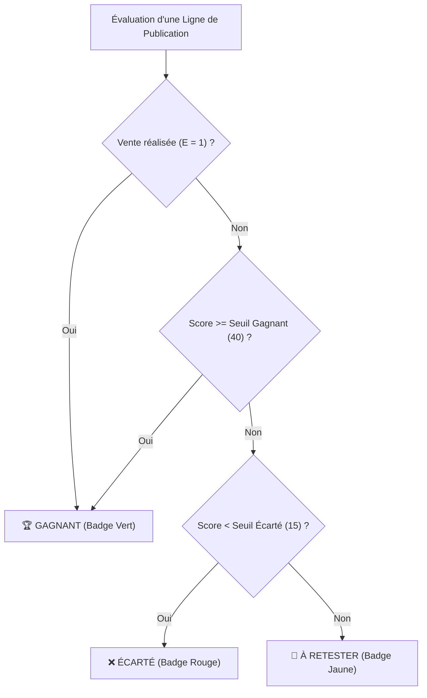
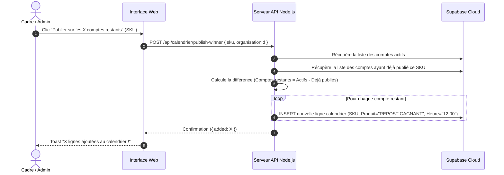

# 📘 Documentation Technique & Algorithmique Détaillée : Vinted Manager

Ce document constitue la spécification technique et fonctionnelle exhaustive de la plateforme **Vinted Manager**. Il détaille l'ensemble des algorithmes, des calculs mathématiques, des structures de données et des fonctionnalités de l'application sous tous les angles.

---

## 📋 Table des Matières
1. [Architecture Globale & Flux de Données]
2. [Algorithme 1 : Moteur de Scoring & Classification des Produits]
3. [Algorithme 2 : Générateur d'Emplois du Temps & Anti-Collision]
4. [Algorithme 3 : Moteur de Propagation des Produits Gagnants]
5. [Algorithme 4 : Analyse Rétrospective des Incidents (Fenêtre 24h)]
6. [Algorithme 5 : Gestionnaire des Reposts & Calcul du Delai Optimal]
7. [Analyse Détaillée de Tous les Modules Fonctionnels]
8. [Matrice des Permissions & Sécurité RBAC]
9. [Structures de Données & Schemas de Base de Données]

---

## 1. 🏗️ Architecture Globale & Flux de Données



---

## 2. 🧮 Algorithme 1 : Moteur de Scoring & Classification des Produits

### A. Formule Mathématique du Score
Chaque publication enregistrée dans le calendrier possède un **Score d'Engagement** calculé dynamiquement. La formule générale s'exprime comme suit :

$$Score = (V \times P_v) + ((L + F) \times P_f) + (M \times P_m) + (E \times P_e)$$

Où :
- $V$ = Nombre de vues enregistrées (`vues`).
- $L$ = Nombre de likes (`likes`).
- $F$ = Nombre de favoris (`favoris`).
- $M$ = Nombre de messages reçus (`messages`).
- $E$ = Statut de vente ($E = 1$ si vendu, $E = 0$ sinon).
- $P_v$ = Coefficent/Poids des vues *(Défaut: 0.1)*.
- $P_f$ = Coefficent/Poids des favoris/likes *(Défaut: 2.0)*.
- $P_m$ = Coefficent/Poids des messages *(Défaut: 5.0)*.
- $P_e$ = Coefficent/Poids des ventes *(Défaut: 20.0)*.

### B. Algorithme de Classification Automatique
Une fois le score calculé, le produit est classé dans l'une des 3 catégories suivantes :



### C. Recalcul Dynamique Global
Lorsque l'Administrateur ou le Cadre modifie l'un des poids $P$ ou seuils dans le module **Paramètres**, le serveur exécute un **recalcul en cascade** :
1. Mise à jour de la table `parametres`.
2. Parcours de l'ensemble de la table `calendrier`.
3. Recalcul de $Score$ et $Classification$ pour chaque ligne.
4. Sauvegarde asynchrone des nouveaux résultats.

---

## 3. ⚙️ Algorithme 2 : Générateur d'Emplois du Temps & Anti-Collision

Le générateur de plannings résout le problème de distribution de créneaux de publication sans surcharger les comptes ni déclencher les filtres anti-bot de Vinted.

### Pseudocode & Logique de l'Algorithme :

```text
Entrées : 
  - nbJours (ex: 7)
  - activeComptes = liste des comptes au statut 'Actif'
  - creneauxParJour (ex: 3)
  - heuresDisponibles = Matin [06:30..11:30] U Midi [12:00..17:00] U Soir [18:00..23:00]
  - decalageMin = 60 minutes

Pour chaque jour j de 0 à (nbJours - 1) :
    dateStr = Aujourd'hui + j jours
    recupereLignesExistantes(dateStr)
    
    Pour s de 0 à (creneauxParJour - 1) :
        Pour chaque compte c dans activeComptes :
            Trouver la première heure h dans heuresDisponibles telle que :
                |Heure(h) - Heure(tous les créneaux déjà occupés)| >= decalageMin
            
            Si h est trouvée :
                Créer nouvelle ligne calendrier(compte=c, date=dateStr, heure=h, statut='Non fait')
                Ajouter h aux créneaux occupés de la journée
```

### Avantages Métier :
- **Absence de collision** : Deux publications sur un même agent ou compte sont séparées d'au moins 60 minutes.
- **Répartition Équitable** : Les comptes actifs tournent en boucle sur les créneaux matin, midi et soir.

---

## 4. 🚀 Algorithme 3 : Moteur de Propagation des Produits Gagnants

Lorsqu'un produit est qualifié de **Gagnant** sur un compte (grâce à ses vues/favoris ou une vente), l'algorithme permet de le dupliquer en 1-clic sur l'ensemble de la flotte.



---

## 5. 🚨 Algorithme 4 : Analyse Rétrospective des Incidents (Fenêtre 24h)

Lorsqu'un incident (blocage, restriction ou ban) est signalé sur un compte, l'algorithme déclenche une enquête statistique automatique sur les dernières 24 heures.

### Étapes de Traitement :
1. **Définition de la Fenêtre Temporelle** : $[T_{\text{incident}} - 24\text{h}, T_{\text{incident}}]$.
2. **Extraction des Publications** : Récupération de toutes les lignes du calendrier associées au `compteId` dont l'horodatage de publication se situe dans la fenêtre 24h.
3. **Agrégation des Métriques** :
   - $nbPubs24h$ = Nombre total de publications tentées ou faites.
   - $heuresPubs24h$ = Liste des heures précises de publication (ex: `["08:30", "12:00", "16:30"]`).
   - $nbVentesConnues$ = Nombre de ventes réalisées dans ce laps de temps.
   - $detailVentes$ = SKUs des articles vendus.
4. **Mise en Quarantaine Automatique** :
   - Si `type == 'Ban définitif'` $\implies$ Statut du compte mis à jour vers `Banni`.
   - Si `type == 'Ban 24h'` ou `'Avertissement'` $\implies$ Statut du compte mis à jour vers `Limité`.
5. **Sauvegarde de l'Incident** : Insertion dans la table `incidents` pour analyse ultérieure.

---

## 6. ⏱️ Algorithme 5 : Gestionnaire des Reposts & Calcul du Delai Optimal

Lorsqu'un utilisateur indique qu'une **Vente** a été réalisée ($vente = 1$), l'algorithme met à jour les indicateurs de repost :

1. **Incrémentation du compteur** : $nbVentesReposts = nbVentesReposts + 1$.
2. **Historique des heures** : Horodatage actuel (ex: `"14:25"`) ajouté au tableau JSON `heuresVentesReposts`.
3. **Calcul de l'heure du Prochain Repost** :

$$prochainRepost = HeureActuelle + \Delta_{repost}$$

Où $\Delta_{repost}$ est le délai configurable de repost (défaut: **30 minutes**). Cela signale à l'agent l'heure exacte à laquelle il doit reposter l'article équivalent.

---

## 7. 🔍 Analyse Détaillée de Tous les Modules Fonctionnels

| Module | Rôle & Fonctionnalités | Composants UI |
| :--- | :--- | :--- |
| **Tableau de Bord** | Vue principale du calendrier. Filtres combinatoires par Compte, Agent, Statut et Classification. Métriques KPI en haut de page. Saisie inline des performances. | Table réactive, Badges colorés, Champs de saisie numériques réactifs. |
| **Comptes** | Répertoire de la flotte des comptes Vinted. Affichage de l'agent référent, du lien du profil, du statut (Actif, Limité, Banni) et des notes. | Modal d'ajout/édition de compte, Badges de statut. |
| **Génération** | Moteur de création automatique de planning sur N jours. Affichage du nombre de comptes actifs prêts. | Formulaire de sélection de durée, Bouton de lancement avec loader. |
| **Classement** | Palmarès agrégé de tous les produits par SKU. Affiche le score maximal atteint, le total de vues, favoris et ventes. | Leaderboard trié par score décroissant, positions (#1, #2...). |
| **Suggestions** | Galerie des produits qualifiés "Gagnants". Permet la propagation multi-comptes en 1-clic. | Grille de cartes produits avec barre de progression de propagation. |
| **Incidents** | Registre des blocages subis. Renseignement des dates/heures et analyse automatique des 24h précédentes. | Formulaire de déclaration d'incident, Table de suivi. |
| **Organisations** | Gestionnaire Multi-Tenancy (Admin uniquement). Création et administration des organisations/agences. | Table des organisations, Modal de création d'organisation. |
| **Utilisateurs** | Gestion des accès et des rôles (Admin, Cadre, Agent). Affectation d'un utilisateur à une organisation et un agent. | Table des utilisateurs avec badges de rôles, Modal de création d'accès. |
| **Paramètres** | Configuration fine des algorithmes (poids des scores, seuils, délais d'intervalle, créneaux horaires). | Formulaire d'édition des coefficients avec recalcul automatique. |
| **Journal** | Audit trail complet (Logs d'activité). Enregistre chaque action utilisateur, connexion, génération ou modification. | Table chronologique des logs avec indicateurs de succès/échec. |

---

## 8. 🛡️ Matrice des Permissions & Sécurité RBAC

```mermaid
gantt
    title Matrice des Droit d'Accès par Rôle
    dateFormat  X
    axisFormat %s

    section 👑 Super Admin
    Gestion des Organisations      :active, a1, 0, 100
    Gestion des Utilisateurs       :active, a2, 0, 100
    Configuration Paramètres       :active, a3, 0, 100
    Export / Import JSON           :active, a4, 0, 100
    Gestion Flotte Comptes         :active, a5, 0, 100
    Génération Plannings           :active, a6, 0, 100
    Saisie & Modif Métriques       :active, a7, 0, 100

    section 👔 Cadre
    Gestion Flotte Comptes         :active, c1, 0, 100
    Génération Plannings           :active, c2, 0, 100
    Configuration Paramètres       :active, c3, 0, 100
    Propagation Produits Gagnants  :active, c4, 0, 100
    Saisie Métriques               :active, c5, 0, 100

    section 🧑‍💼 Agent
    Saisie Métriques (Ses comptes) :active, ag1, 0, 100
    Consultation Incidents         :active, ag2, 0, 100
```



---

## 9. 🗄️ Structures de Données & Schemas Supabase PostgreSQL

### Table `organisations`
```sql
CREATE TABLE organisations (
    id TEXT PRIMARY KEY,
    nom TEXT NOT NULL,
    dateCreation TEXT DEFAULT ''
);
```

### Table `utilisateurs`
```sql
CREATE TABLE utilisateurs (
    id TEXT PRIMARY KEY,
    nom TEXT NOT NULL,
    email TEXT UNIQUE NOT NULL,
    role TEXT CHECK (role IN ('admin', 'cadre', 'agent')) NOT NULL DEFAULT 'agent',
    organisationId TEXT NOT NULL DEFAULT 'org_default',
    agentAssigne TEXT DEFAULT '',
    motDePasse TEXT DEFAULT '123456',
    dateCreation TEXT DEFAULT ''
);
```

### Table `comptes`
```sql
CREATE TABLE comptes (
    id TEXT PRIMARY KEY,
    organisationId TEXT NOT NULL DEFAULT 'org_default',
    pseudo TEXT NOT NULL,
    agent TEXT NOT NULL,
    lienProfil TEXT DEFAULT '',
    statut TEXT DEFAULT 'Actif',
    dateCreation TEXT DEFAULT '',
    notes TEXT DEFAULT ''
);
```

### Table `calendrier`
```sql
CREATE TABLE calendrier (
    id TEXT PRIMARY KEY,
    organisationId TEXT NOT NULL DEFAULT 'org_default',
    date TEXT NOT NULL,
    jour TEXT NOT NULL,
    compteId TEXT NOT NULL,
    agent TEXT NOT NULL,
    heurePrevue TEXT NOT NULL,
    sku TEXT DEFAULT '',
    produit TEXT DEFAULT '',
    lien TEXT DEFAULT '',
    vues INT DEFAULT 0,
    likes INT DEFAULT 0,
    favoris INT DEFAULT 0,
    messages INT DEFAULT 0,
    vente INT DEFAULT 0,
    score FLOAT DEFAULT 0,
    classification TEXT DEFAULT 'À retester',
    statut TEXT DEFAULT 'Non fait',
    dateStatut TEXT,
    heureStatut TEXT,
    nbVentesReposts INT DEFAULT 0,
    heuresVentesReposts JSONB DEFAULT '[]'::jsonb,
    prochainRepost TEXT
);
```
